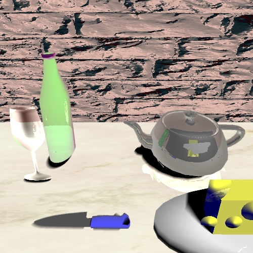
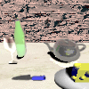

# CS488 Fall 2017 Project Code

---

## Dependencies
* OpenGL 3.2+
* GLFW
    * http://www.glfw.org/
* Lua
    * http://www.lua.org/
* Premake4
    * https://github.com/premake/premake-4.x/wiki
    * http://premake.github.io/download.html
* GLM
    * http://glm.g-truc.net/0.9.7/index.html
* ImGui
    * https://github.com/ocornut/imgui

---

## Building Project
We use **premake4** as our cross-platform build system. First you will need to build all
the static libraries that the projects depend on. To build the libraries, open up a
terminal, and **cd** to the top level of the CS488 project directory and then run the
following:

    $ premake4 gmake
    $ make

This will build the following static libraries, and place them in the top level **lib**
folder of your cs488 project directory.
* libcs488-framework.a
* libglfw3.a
* libimgui.a

Next we can build a specific project.  To do this, **cd** into one of the project folders,
say **A0** for example, and run the following terminal commands in order to compile the A0 executable using all .cpp files in the A0 directory:

    $ cd Project/
    $ premake4 gmake
    $ make

## Generate images
To generate the images, `mv Assets` and then `../Project [number of images]`. The images generated will be `project_{i}.png` for some i to represent its order in the animation. Furthermore, these images will be keyframes for my particle system animation. If you just want one image, simply run `../Project 1`. By specifying 1 image, the particle system will also not be displayed in the image. Otherwise, if you request more than 1 keyframe, project.gif for the animation will be also generated in the `Assets` folder.

## Objectives
- Mirror reflections on at least one object
- Refraction on at least one object
- Phong shading on objects
- Adaptive supersampling for antialising
- Texture mapping on at least one object
- Bump mapping on at least one object
- Soft shadows
- Constructive solid geometry used for at least one object
- Unique scene is portrayed in the image
- One animation of "fuzzy" or "gaseous" object by modelling with particle systems

## Raytraced images

